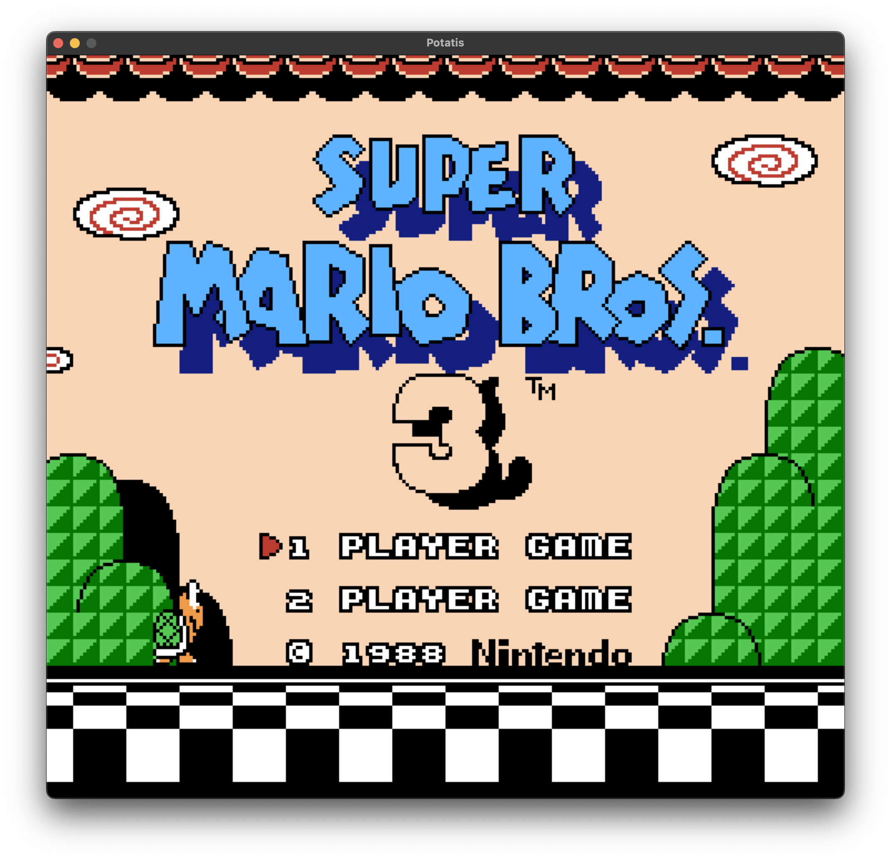
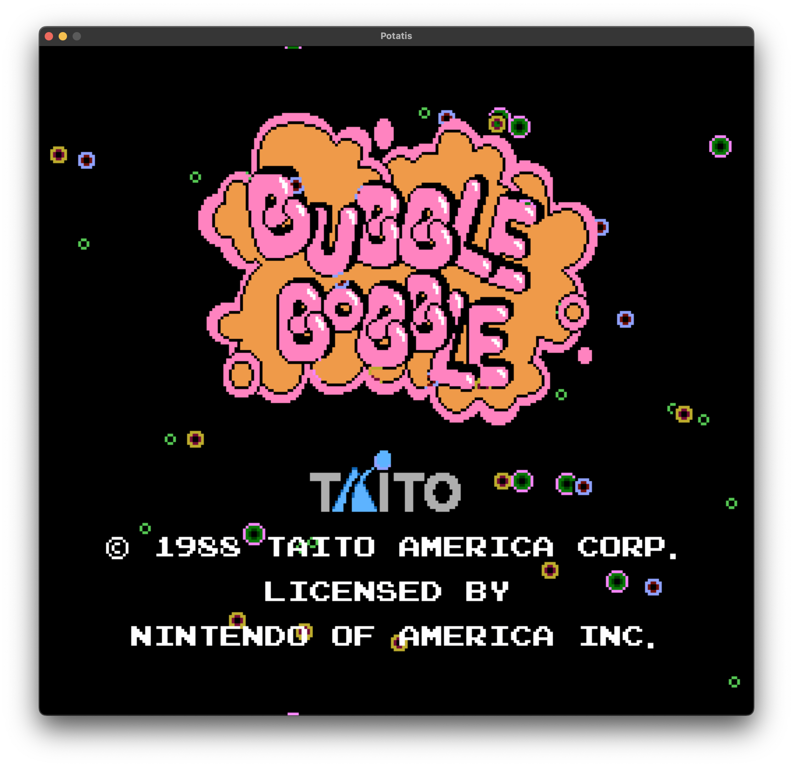
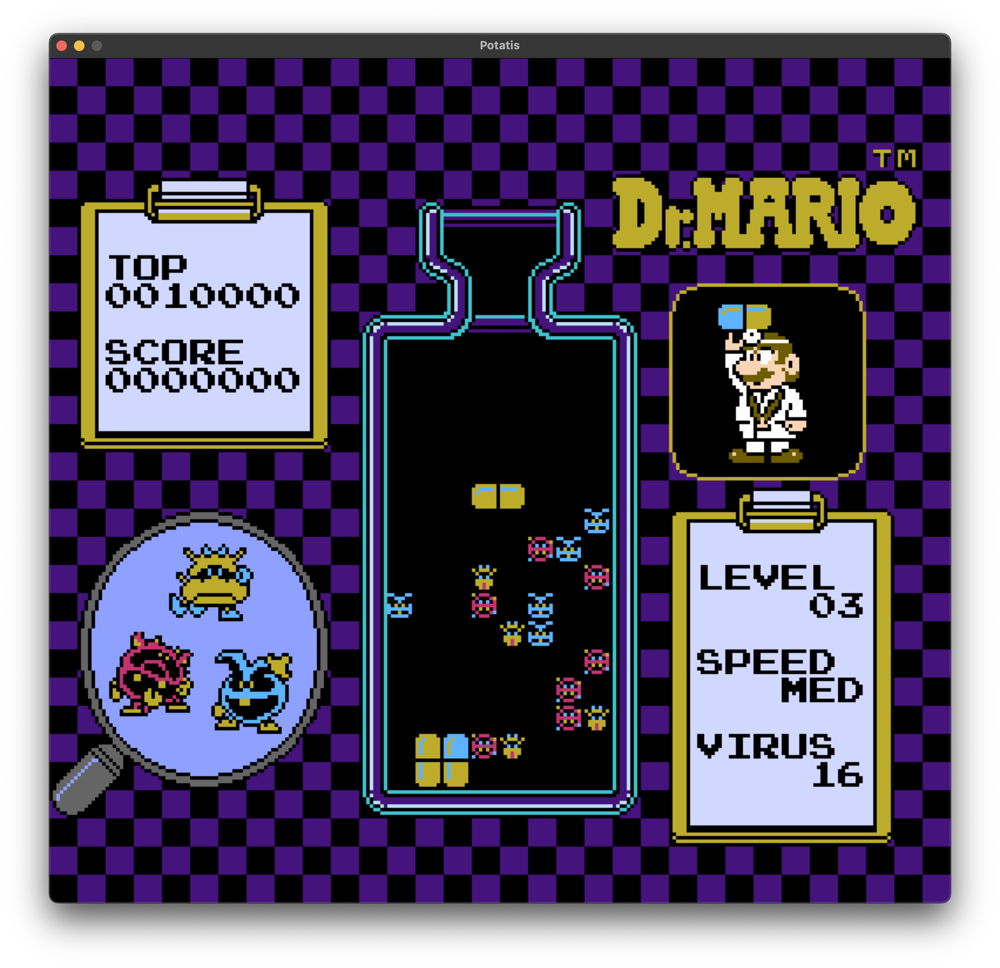

# 🥔 Potatis




- `/mos6502` - Generic CPU emulator. Passes all tests, including illegal ops. (No BCD mode).
- `/nes` - A very incomplete NES emulator.
- `/nes-sdl` - Native target using SDL.
- `/nes-wasm` - Browser target using WASM.

## /mos6502

```rust
let load_base = 0x2000;
let mem = Memory::load(&program[..], load_base);
let cpu = Cpu::new(mem);
let mut machine = Mos6502::new(cpu);

loop {
  machine.tick()
  println!("{}", machine); // Will print nestest-like output
}
```

### Debugging

```rust
let mut debugger = machine.debugger();
debugger.verbose(true); // Trace, dumps disassembled instructions to stdout
debugger.add_breakpoint(Breakpoint::Address(0x0666));
debugger.add_breakpoint(Breakpoint::Opcode("RTI"));
debugger.watch_memory_range(0x6004..=0x6104, |mem| {
  // Invoked when memory in range changes
});
```

## /nes

Supported mappers:
- NROM (mapper 0)
- MMC1 (mapper 1)
- UxROM (mapper 2)
- CNROM (mapper 3)
- MMC3 (mapper 4)

```rust
impl nes::HostSystem for MyHost {
  fn render(&mut self, frame: &RenderFrame) {
    // frame.pixels() == 256 * 240 * 4 RGBA array
  }

  fn poll_events(&mut self, joypad: &mut Joypad) {
    // pump events and forward to joypad
  }
}


let cart = Cartridge::blow_dust("path/to/rom.nes")?;
let mut nes = Nes::insert(cart, MyHost::new());

loop {
  nes.tick();
  println!("{:?}", nes); // Complete nestest formatted output
}
```

## /nes-sdl

`cargo run --release path/to/rom.nes`

`cargo run -- --help` for options

## /nes-wasm

1. `cd nes-wasm`
2. `wasm-pack build --release --target web`
3. `npm install`
4. `npm run dev`

Try it here: https://henrikpersson.github.io/nes/index.html

# Test

Run all unit and integration tests (for all crates):

`cargo test`

# TODO

- More mappers
- APU

# Key mappings

Up, left, down, right: `WASD`
B: `K`
A: `L`
Select: `[Space]`
Start: `[Enter]`
Reset: `R`


# Thanks
- nesdev.org
- https://www.masswerk.at/6502/6502_instruction_set.html
- https://github.com/amb5l/6502_65C02_functional_tests
- http://www.baltissen.org/newhtm/ttl6502.htm (TTL6502.bin test)
- https://www.nesdev.com/neshdr20.txt
- https://github.com/christopherpow/nes-test-roms
- http://nesdev.org/loopyppu.zip
- https://www.youtube.com/watch?v=-THeUXqR3zY
- https://archive.nes.science/nesdev-forums/f2/t664.xhtml
